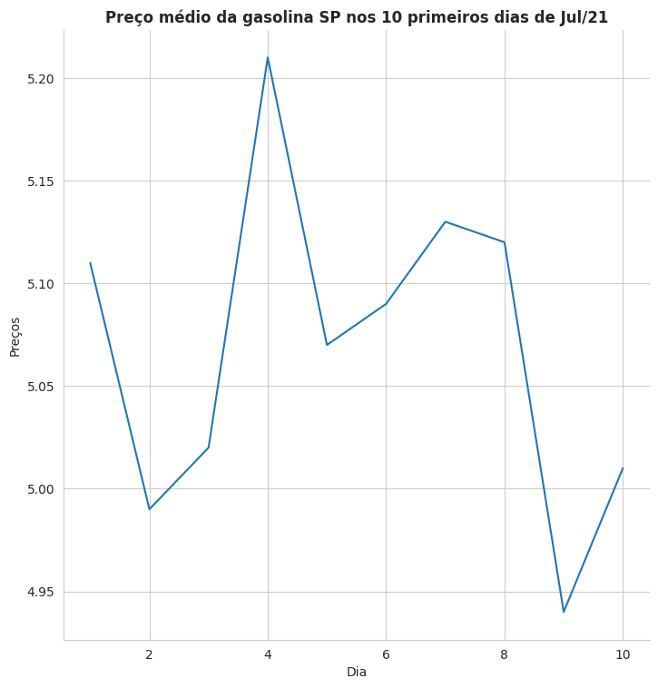

# Preços da gasolina 10 primeiros dias de Jul/21

Geração do gráfico dos 10 primeiros dias de Jul/21, referentes ao preço da gasolina no estado de SP

## Introdução

A partir dos dados do arquivo gasolina.csv, foi gerado o gráfico mostrando a variação do preço médio ao longo desses 10 dias. Lembrando que esta amostra, é o preço médio praticado na cidade de SP durante esse período

## Conteúdo

**arquivo gasolina.csv**

| Coluna  | Descrição                   |
| ------- | --------------------------- | 
| dia     | Dia da venda                |
| venda   | Valor da venda              |

O arquivo está no sub-diretório base/.

Para download do arquivo [gasolina.csv](gasolina/base/gasolina.csv)

**arquivo gasolina.py**

Programa Python que lê o dados do arquivo e gera o gráfico em tela e também no formato PNG.
O programa está no sub-diretório code/

Para download do arquivo [gasolina.py](gasolina/code/gasolina.py)

**arquivo gasolina.png**

A imagem gerada está sendo armazenada no diretório image.

Para download do arquivo [gasolina.png](gasolina/image/gasolina.png)
